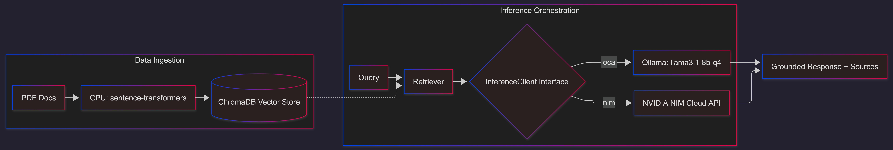

# NIM-Ready Edge RAG on RTX 4060

Local-first Retrieval-Augmented Generation prototype with manual provider switching.

## Architecture

RAG pipeline architecture (retrieval + generation flow):



```text
PDF -> Chunking -> CPU Embeddings -> Chroma -> Top-k Retrieval -> InferenceClient(local|nim) -> Answer + Sources
```

## NIM-Ready Portability Statement

This project is architected for NVIDIA NIM-style portability through an inference interface and environment-driven provider selection.
No auto-failover is used. You switch providers manually with `INFERENCE_PROVIDER=local|nim` while keeping the same RAG orchestration and output schema.

## Hardware & Performance Benchmarks

Recommended baseline hardware:
- GPU: NVIDIA RTX 4060 8GB
- CPU: modern 6+ core CPU
- RAM: 16GB+

Run benchmarks (10 runs/query by default):

```bash
edge-rag benchmark --query "What is X?" --query "How does Y work?" --output benchmarks/benchmark_report_q4.json
```

Optional q8 comparison (runs only when q4 peak VRAM <= 7.5GB and q8 model exists):

```bash
edge-rag benchmark --query "What is X?" --compare-q8
```

Report fields include:
- TTFT (`ttft_seconds`)
- Generation latency (`generation_seconds`)
- Tokens per second (`tokens_per_second`)
- Peak VRAM (`peak_vram_mb`)
- Stability notes based on 10-run variability

Current measured benchmark snapshot (10 runs per query, Jetson-only corpus).

Queries:
- What is the theoretical peak memory bandwidth of Jetson Orin NX?
- What CPU architecture and core count are listed for Jetson Orin NX?
- What power modes or power range are specified for Jetson Orin NX?

Per-query means:

| Query | local q4 TTFT | local q4 TPS | local q8 TTFT | local q8 TPS | nim TTFT | nim TPS |
|---|---:|---:|---:|---:|---:|---:|
| Memory bandwidth | 3.284 | 5.89 | 3.848 | 3.48 | 0.370 | 28.17 |
| CPU architecture + core count | 2.332 | 16.53 | 2.609 | 6.03 | 0.651 | 35.52 |
| Power modes / range | 2.528 | 22.41 | 2.604 | 6.77 | 1.292 | 37.30 |

Overall aggregate means across the 3 queries:

| Provider | Model | TTFT Mean (s) | TPS Mean | Peak VRAM Max (MB) | Quality (Faithfulness, manual n=5) |
|---|---|---:|---:|---:|---:|
| local | llama3.1:8b-instruct-q4_K_M | 2.715 | 14.94 | 7315 | 5/5 |
| local | llama3.1:8b-instruct-q8_0 | 3.021 | 5.43 | 7315 | 5/5 |
| nim | meta/llama-3.1-8b-instruct | 0.771 | 33.66 | 7315 | 5/5 |

Quality note:
- NVIDIA RAG quality evaluation can be framed as RAGAS/NVIDIA Metrics style checks.
- Faithfulness measures whether answers stay grounded in the indexed PDFs and cited chunks.
- Fill each `TBD` entry by manually checking 5 sampled responses per provider and scoring: `faithfulness = grounded_answers / 5`.

Detailed reports:
- `benchmarks/benchmark_report_local_q4_jetson_multi.json`
- `benchmarks/benchmark_report_local_q8_jetson_multi.json`
- `benchmarks/benchmark_report_nim_jetson_multi.json`
- `benchmarks/benchmark_summary_jetson_multi.json`

## Security and Secret Handling

1. Rotate any exposed `nvapi-` keys immediately.
2. Keep keys only in local `.env`.
3. Commit placeholders only (`.env.example`).
4. Never include secrets in benchmark outputs, docs, or logs.

Repository hygiene checklist:
- `.env` is gitignored.
- `.env.example` uses placeholders only.
- No key appears in commit diff or terminal history committed to repo.

## Install

```bash
python -m venv .venv
. .venv/Scripts/activate
pip install -r requirements.txt
pip install -e .
```

## Local Prerequisites

- Python 3.10+
- Ollama installed and running
- NVIDIA driver with `nvidia-smi` accessible

Model pulls:

```bash
ollama pull llama3.1:8b-instruct-q4_K_M
# Optional
ollama pull llama3.1:8b-instruct-q8_0
```

## Usage

Run prerequisites and security checks first:

```bash
edge-rag preflight
```

Pull and validate the required local q4 model:

```bash
edge-rag pull-model
```

Index all PDFs in `data/pdfs`:

```bash
edge-rag index
```

Index one PDF:

```bash
edge-rag index --pdf-path data/pdfs/sample.pdf
```

Ask a question:

```bash
edge-rag ask --query "What does the document say about memory bandwidth?"
```

Switch provider:

```bash
# local
set INFERENCE_PROVIDER=local

# nim
set INFERENCE_PROVIDER=nim
set NVIDIA_API_KEY=nvapi-REPLACE_ME
```

Provider parity check (same schema for local and nim):

```bash
edge-rag parity --query "Summarize the key constraints."
```

## Citation Format

Each answer includes a `Sources` section in this format:
- `filename=<name>, page=<n>, chunk_id=<id>`

